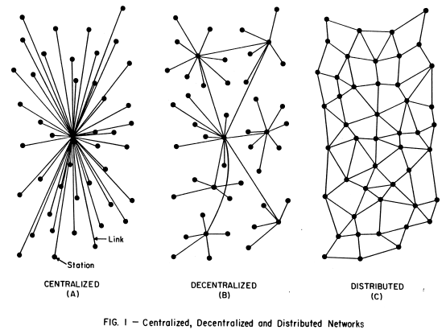

# Consensus Protocols

"Consensus protocols are used to allow computers to work together" and let different servers agree on the state of a system". ([Software Engineering Daily](https://softwareengineeringdaily.com/2018/03/26/consensus-systems-with-ethan-buchman/))

**Resilience**: the ability of a consensus protocol to adapt to failure.

## State
 State maintains historical information, state can be defined as a set of variables describing a certain system at a specific time.

 For a distributed computer network, state typically involves technical information about critical actors in a system.

Examples:
- Airplane or spaceship, state includes current status of different parts of the ship, temperature or atmospheric data, fuel, or energy levels, etc..
- Social media site, state includes when a user logged in, what they did, where they were, etc..

A historical understanding of the system begins to *emerge* from these state changes.

## Nodes
A node is defined as an electronic device that is attached to a network, and is capable of creating, receiving, or transmitting information over a communication channel.

Nodes can be Leaders (responsible for proposing values), Acceptors (nodes that receive values from Leader and accept them), and Processors (do operations on received values). These roles are not exclusive to individual node.

## Message Propagation
How nodes in a network propagate their messages is known as its topology.

- Centralized systems: can quickly distribute messages but aren't resilient. (If the single central node collapses, so does the network)

## Time
The notion of time is very important in a distributed system as it creates an order for the larger system. Event ordering that occur in a system is particularly important.

## Periods
Every consensus protocol requires discrete periods of activity. In blockchain systems, these periods typically revolve around the creation and propagation of  transaction in a *block*.

## Fault Tolerance
Fault tolerance is a formal description of resilience.

How many bad nodes can we have in a system before the system ceases to propagate state?

The most amount of fault a *distributed* network can absorb is one-third.

[Byzantine Fault Tolerance](https://en.wikipedia.org/wiki/Byzantine_fault)
