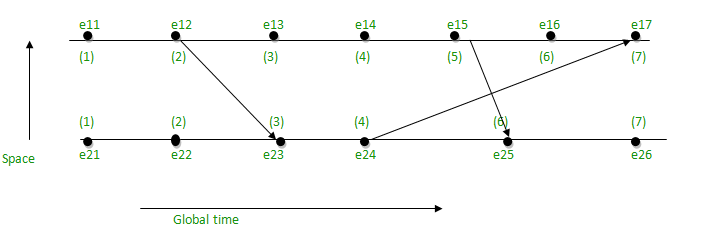

# Distributed System (Properties)

Every distributed system will include the following set of characteristics.

## Concurrency
Multiple events occur at the same time. Each other computer in the network executes events independently and concurrently as other computers in the network.

## Lack of a global clock
We need a way to determine the order of events in order for a distributed system to work. But the computers are operating concurrently and there is no single global clock to determine the sequence of events happening across all the nodes in the network.

Leslie Lamport showed that we can deduce the order of event by remembering the following factors:
1. Messages are sent before they are received.
2. Each computer has a sequence of events.

([Time, Clocks and Ordering of Events in a Distributed System, Lamport, 1978](https://lamport.azurewebsites.net/pubs/time-clocks.pdf))

The paper demonstrates that time and order of events are fundamental obstacles in a distributed system:
- The algorithm can still allow for anomalous behavior.
- Clock drift, a phenomenon in which clocks count time at slightly different rates.

(Example of [Lamport Clock](https://en.wikipedia.org/wiki/Lamport_timestamp))

## Independent failure of components
It is impossible to have a system free of faults.

- Crash-fail: The component stops working without warning.
- Omission: The component sends a message but it is not received by the other nodes.
- Byzantine: The component behaves arbitrarily. This type of fault is irrelevant in a controlled environment. The faults occur as an "adversarial context". In a decentralized network, the nodes may choose to act in a "Byzantine" manner, maliciously choosing to alter, block, or not send messages at all.

## Models
Two types of Models to consider when making a distributed system.

### 1) Simple fault-tolerance
We assume all the nodes either follow protocol examples or they fail, we don't have to worry about nodes exhibiting arbitrary or malicious behavior

### 2a) Byzantine fault-tolerance
We assume nodes can fail or be malicious.

### 2b) BAR fault-tolerance
We assumes nodes can fail rationally, wherein nodes can deviate if it is in their self-interest to do so. If the incentives are high enough, then the majority of the nodes might act dishonestly.

Bar Model assumes three types of nodes:
- (B)yzantine: Byzantine nodes are malicious and trying to screw you.
- (A)ltruistic: Honest nodes always follow the protocol.
- (R)ationa: Rational nodes only follow protocol if it suits them.

## Message Passing
- Synchronous: It is assumed that messages will be delivered within some fixed, known amount of time. The receiving party will receive the message within a certain time frame.
- Asynchronous: It is assumed that a network may delay messages infinitely, duplicate them, or deliver them out of order. There is no fixed upper bound on how long a message will take to be received.