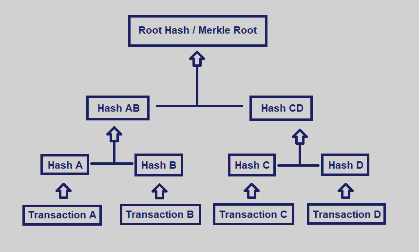
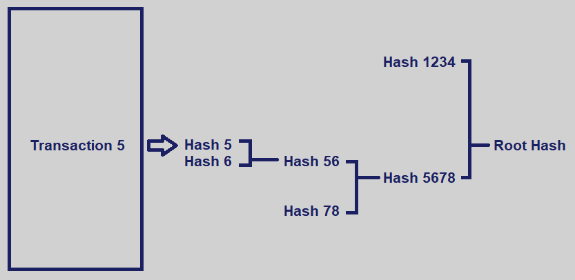

# Merkle Tree

A Merkle Tree summarizes all the transactions in a block by producing a digital fingerprint (hash) of the entire set of transactions. 

The tree has a bottom up approach. Every leaf (node) is labelled with the cryptographic hash of a data block, and every node that's not a leaf is labelled with the cryptographic hash of the labels of its child nodes.

Merkle trees are created by repeatedly hashing pairs of nodes until there is only one hash left, the Merkle Root. 

Merkle Root summarizes all of the data in the related transactions, and is stored in the block header. It maintains the integrity of the data. The Merkle Root will change if the detail in any of the transactions change. We can use a Merkle Tree to quickly determine whether the transaction is included in the set.

## Benefits

1. Merkle trees provide a means to prove the integrity and validity of data.
2. Merkle Trees require little memory or disk space as the proofs are computationally easy and fast.
3. Merkle Tree proofs and management only require tiny amounts of information to be transmitted across networks.

